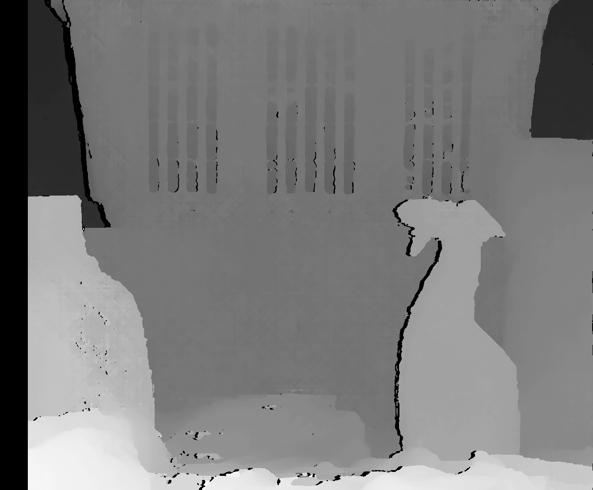

# project-cumulus

## Description
This code compares three different disparity map calculation approaches, i.e., naive approach, dynamic programming approach, and the built-in OpenCV StereoSGBM approach, to a ground truth disparity map. Using the disparity maps, the point clouds are reconstructed including an oriented point cloud and a rudimentary triangulated surface mesh.

## Requirements
- Working C++ compiler (C++ 17 or greater)
- CMake (version >= 2.8)
- OpenCV (version >= 4.0.0)
- PCL

## Usage
- `./stereo <path to left image> <path to right image> <path to ground truth disparity image> <output file prefix> <window size> <lambda> <dmin>`

## Example Results

